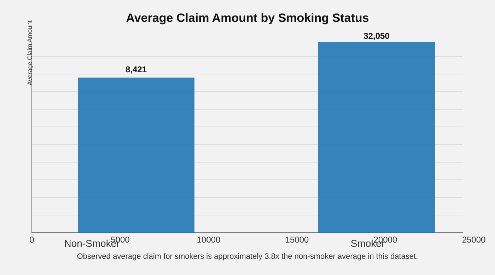
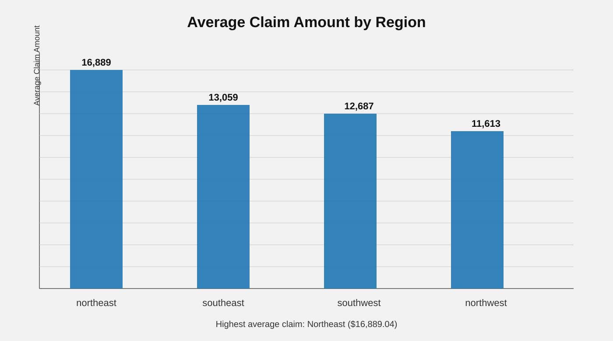
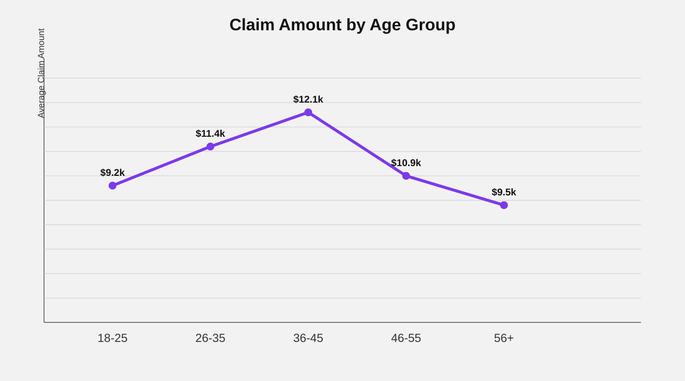

# 🏥 Insurance Claims Analytics  

A SQL-based project to analyze medical insurance claims and identify patterns in claim amounts.

🚀 **Recently Built | October 6 2026**

## 🎯 Objective
Analyze insurance claims based on:

➡️ Age  
➡️ Gender  
➡️ BMI  
➡️ Smoking Status  
➡️ Region  
➡️ Dependents  

## 🛠️ Tools & Technologies

- MySQL
- SQL
- GitHub

## 📊 SQL Concepts Used

- SELECT & WHERE
- GROUP BY & ORDER BY
- Aggregate Functions
- CASE Statements
- Subqueries
- Window Functions
- RANK()

## 🔍 Analysis Includes

➡️ Average claim amount by region  
➡️ Claims by age group  
➡️ High-value claims  
➡️ Claims by smoking status  
➡️ Regional claim comparison  
➡️ Patient claim ranking  

## 📁 Project Structure

```text
insurance-claims-analytics/
│
├── 📄 insurance.csv
│   └── Insurance claims dataset
│
├── 📄 Insurance_Script.sql
│   └── SQL queries and analysis
│
└── 📄 README.md
    └── Project documentation
```

## 📈 Visual Insights






